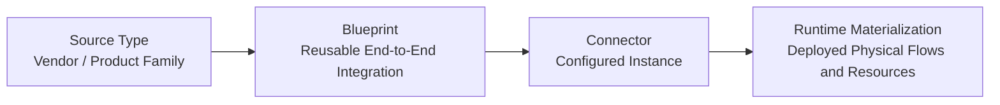
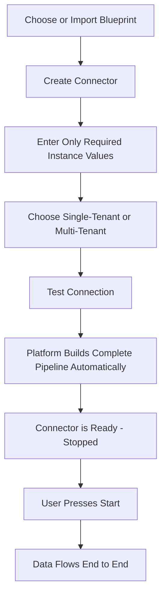
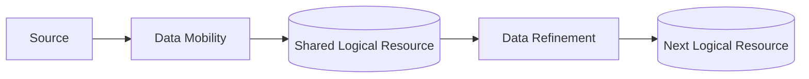
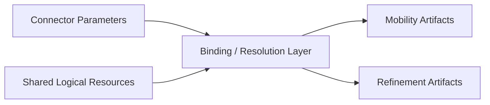
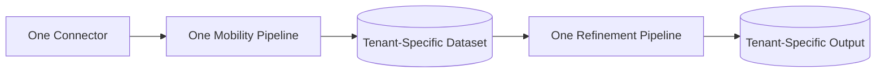
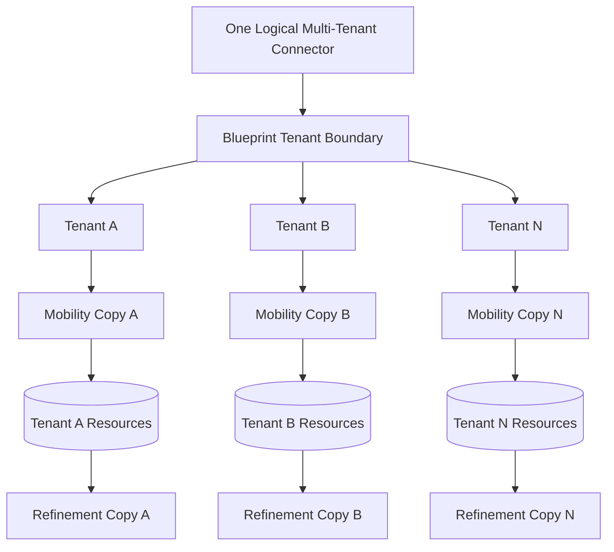
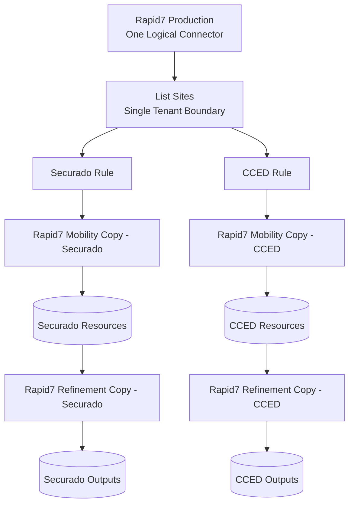
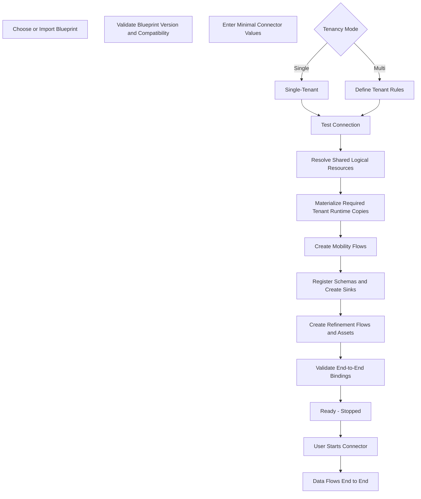

# Unified Connector Feature — Canonical Product Design

## 1. Purpose

The Connector feature turns a fully built source integration into a **plug-and-play product**.

Instead of rebuilding the same ingestion and refinement pipelines for every customer, the platform keeps one reusable **Blueprint** and allows users to create many configured **Connector instances** from it.

For example:

- **Source Type:** Rapid7 InsightVM
- **Blueprint:** Rapid7 InsightVM Blueprint v1
- **Connector:** Rapid7 — Securado
- **Connector:** Rapid7 — Asyad
- **Connector:** Rapid7 — Customer X

The complex integration logic is built once. Each Connector only supplies the small amount of information that genuinely changes between instances.

---

## 2. Core Product Model

The complete model is:



### Source Type

A Source Type represents the vendor or product family independently of any customer.

Examples:

- Rapid7 InsightVM
- SentinelOne
- FortiSIEM
- PostgreSQL

There is one Source Type definition even when many customers use it.

### Blueprint

A Blueprint is the reusable definition of how that source works from end to end.

It contains the complete prebuilt behavior for:

- Data Mobility
- schema handling
- Kafka and sink setup
- shared resource relationships
- Data Refinement
- models and mappings
- scripts
- source entities
- tenancy capability
- expected lineage and health behavior
- version and compatibility information

The Blueprint is created by someone designing the integration.

### Connector

A Connector is a configured instance of a Blueprint.

It contains only the values that genuinely change for that customer, source instance, site, tenant, or environment.

Examples:

```text
Rapid7 Blueprint
├── Rapid7 - Securado
├── Rapid7 - Asyad
└── Rapid7 - Customer X
```

### Runtime Materialization

The runtime layer is what the unified platform physically deploys:

- Mobility flows
- Kafka topics
- schemas
- sink configurations
- datasets / tables
- Refinement flows
- tenant-specific copies where required

The normal user should manage the **Connector**, not the lower-level runtime objects.

---

## 3. Main User Experience

The intended experience is:



A mature Connector should not require the user to:

- rebuild NiFi flows;
- infer schemas manually;
- create Kafka sync configuration manually;
- discover table names;
- reconnect Mobility output tables to Refinement inputs;
- recreate mappings;
- rebuild normalization flows;
- configure internal pagination;
- configure internal read/write behavior;
- manually duplicate flows for tenants.

All of that belongs to the Blueprint or is generated automatically by the platform.

---

## 4. Flow Granularity

Blueprint flows remain **per source**, matching how the two applications are designed today.

A Blueprint may contain one or more Mobility flows and one or more Refinement flows for the same source.

Entities do not require one separate flow each.

For example:

```text
Rapid7 Blueprint

Mobility Flow A
├── Site
├── Asset
└── Service

Mobility Flow B
├── Vulnerability
└── Asset Vulnerability
```

The entity model references the flows that produce or refine each entity.

This allows a Blueprint to represent the real source integration without forcing a flow-per-entity design.

---

## 5. What the User Configures

The guiding rule is:

> **Expose only values that genuinely differ between instances of the same Blueprint.**

For a Rapid7 Connector, this may include:

- Base URL
- Credential reference
- Collection schedule
- Connectivity or proxy settings only when genuinely instance-specific
- Single-tenant or multi-tenant mode
- Tenant definitions and tenant rules when multi-tenancy is enabled
- Optional entity enable / disable controls
- Minimal Refinement controls

Different sources can expose different fields, but the Connector structure itself remains the same.

### Example

A user creating **Rapid7 — Securado** may only need to provide:

```text
Connector Name: Rapid7 - Securado
Base URL:       https://...
Credentials:    Rapid7 Securado Credential
Schedule:       Every 6 hours
Tenancy:        Single Tenant
```

Everything else is inherited from the Rapid7 Blueprint.

---

## 6. Typed Parameter Model

Every user-facing Connector input is declared by the Blueprint through a typed parameter definition.

A parameter can define:

- field name;
- label and description;
- data type;
- required or optional;
- secret or non-secret;
- default value;
- visibility;
- validation rules;
- whether it can be changed after deployment.

For example:

```text
Base URL
Type: URL
Required: Yes
Secret: No

Credential
Type: Credential Reference
Required: Yes
Secret: Yes

Schedule
Type: Schedule
Required: No
Default: Blueprint Default
```

The parameter system is generic, but the Blueprint should expose only the minimum parameters that genuinely vary by Connector instance.

Internal capabilities do **not** automatically become user parameters.

---

## 7. What Stays Inside the Blueprint

The user should not be asked to configure internal implementation details such as:

- API paths
- pagination logic
- cursor handling
- response extraction rules
- routing implementation
- NiFi processor configuration
- Kafka topic internals
- schema registration behavior
- sink implementation
- Iceberg write details
- deduplication rules
- normalization rules
- field mappings
- model versions
- lookup rules
- flattening logic
- merge logic
- survivorship rules
- SQL or script internals
- rebuild behavior

These define **how the integration works**, not **which instance is being created**.

If two deployments genuinely require different integration logic, that should normally result in a different Blueprint version or variant rather than exposing more low-level configuration to the Connector user.

---

## 8. Shared Resources Between Mobility and Refinement

The unified application must not duplicate information that both sides use.

For example, Mobility may produce a dataset that Refinement consumes.

That dataset should be defined once as a shared logical resource.



The platform resolves the real physical resource name once.

For example:

```text
Logical resource:
asset.bronze.raw

Resolved physical table:
bronze.rapid7_securado.asset__raw
```

Mobility writes to it.

Refinement reads from the exact same resolved resource.

The user never has to enter the same table name twice.

The same principle applies to:

- Kafka topics
- Bronze datasets
- Current datasets
- Silver datasets
- Gold / canonical datasets
- generated flow names
- tenant-specific namespaces
- other cross-platform resource identities

Bronze and Silver are examples, not hard-coded limits. The resource model must be able to represent any logical dataset required by the Blueprint.

---

## 9. Binding and Resolution Layer

The platform needs an internal mechanism that connects Connector values and shared resources to the native Mobility and Refinement artifacts.

That is the **binding / resolution layer**.



Examples:

```text
Connector Base URL
→ bound into the Mobility source connection

asset.bronze.raw
→ bound as Mobility output
→ bound as Refinement input
```

The user does not configure bindings manually.

They are Blueprint-owned and allow the platform to reuse native Mobility and Refinement artifacts without inventing a second flow language.

---

## 10. Data Refinement Control

Data Refinement should remain highly automated, but it should not be completely uncontrollable.

The Connector should expose only a very small number of high-level controls.

### Enable / Disable Refinement

Allows the user to intentionally stop the pipeline at ingestion when required.

### Run Mode

Two choices:

- **Automatic**
- **Manual**

Automatic means the Blueprint uses its predefined downstream trigger behavior.

The user does not configure individual Refinement schedules or nodes.

### Initial Load

A small advanced option for how Refinement should begin processing:

- Blueprint Default
- Latest
- Beginning
- From Timestamp
- Last N Snapshots

Everything below this level remains Blueprint-owned.

---

## 11. Entity Model and Capability Manifest

A source can contain many different entities.

For example, a Rapid7 Blueprint may include:

```text
Site
Asset
Vulnerability
Asset Vulnerability
Software
Service
Tag
```

Each entity is described independently because different entities can have different semantics and downstream value.

The Blueprint therefore declares, per entity:

- expected normalized / OCSF class;
- capabilities contributed;
- identifiers carried;
- expected identifier coverage where relevant;
- collection semantics such as snapshot, event, or re-observed data;
- logical resources associated with the entity;
- Mobility and Refinement flows associated with the entity.

Conceptually:

```text
Entity: Asset
Class:  <normalized / OCSF class>
Capability: Asset Inventory

Identifiers
- object_id
- hostname
- IP
```

The manifest is an expectation declared by the Blueprint.

Runtime observations are tracked separately.

---

## 12. Optional Entity Enable / Disable

A Blueprint may contain entities that are optional for a particular Connector instance.

Where the Blueprint explicitly allows it, the user may enable or disable those entities at a high level.

For example:

```text
Assets             Enabled
Sites              Enabled
Software           Enabled
Vulnerabilities    Disabled
```

The user is not editing the flow itself.

The platform simply materializes or activates the relevant Blueprint-defined paths and artifacts.

---

# 13. Single-Tenant and Multi-Tenant Design

The Connector supports exactly two tenancy modes:

```text
Single Tenant
Multi-Tenant
```

There is no separate "shared multi-tenant" mode.

Single-tenant is the default.

Multi-tenancy is explicitly enabled only when one logical source instance contains data for more than one customer or tenant.

The chosen multi-tenant model is:

> **One logical multi-tenant Connector in the UI, materialized internally as separate tenant-scoped Mobility and Refinement pipelines.**

Each physical tenant pipeline writes its own tenant-specific resources.

---

# 14. Single-Tenant Mode

This is the normal case.



Example:

```text
Rapid7 - Securado
```

The platform creates one complete end-to-end pipeline.

No tenant routing is required.

No tenant-based flow duplication is required.

---

# 15. Multi-Tenant Mode

Multi-tenancy is used when one logical source connection contains data for more than one tenant.

The user still sees **one Connector**.

The platform creates a tenant-specific backend copy for every configured tenant.



The user does not manually clone either application.

The Connector remains one logical object in the unified platform.

---

## 16. One Tenancy Boundary Per Flow

Multi-tenancy begins at one clearly defined point in a Mobility flow.

The Blueprint author selects the adapter where tenant identity first becomes available.

For example:

```text
List Sites
```

That adapter becomes the **Tenant Boundary**.

From that point onward, the tenant rule applies to every downstream branch that belongs to that tenant-scoped part of the flow.

For any individual flow:

> **There can be zero or one Tenant Boundary. Tenancy never starts a second time later in the same flow.**

This keeps the behavior predictable and avoids nested or repeated tenancy logic.

If a Blueprint contains multiple source-level Mobility flows, each flow may be single-tenant or may define one tenant boundary where required. A single flow never contains multiple tenancy start points.

---

## 17. What the Blueprint Stores for Multi-Tenancy

The Blueprint stores only the reusable tenancy capability.

For each relevant Mobility flow, it defines:

- whether the flow supports multi-tenancy;
- the single Tenant Boundary adapter;
- the field used to distinguish tenants;
- the data type of that field;
- the allowed rule operators;
- the fact that the rule applies to the downstream graph;
- how tenant identity should be written into generated records.

For example:

```text
Flow: Rapid7 Site / Asset Flow
Tenant Boundary: List Sites
Selector Field: name
Allowed Rules:
- equals
- not equals
- in
- not in
- contains
- matches

Scope:
All downstream branches after List Sites
```

The Blueprint does **not** contain customer-specific tenant values.

---

## 18. What the Connector Stores for Multi-Tenancy

The Connector stores the actual tenant configuration for that instance.

For example:

```text
Connector: Rapid7 Production
Tenancy: Multi-Tenant

Tenant: Securado
Rule: site name != "CCED Windows QUARTER"

Tenant: CCED
Rule: site name == "CCED Windows QUARTER"
```

The Connector user only supplies:

- tenant ID;
- tenant display name;
- tenant slug if needed;
- the rule value or expression supported by the Blueprint.

The user does not re-enter:

- the adapter;
- the selector field;
- the downstream branches;
- the internal NiFi routing implementation.

Those are already defined by the Blueprint.

---

## 19. How the Tenant Rule Works

The user defines the rule once per tenant.

The platform applies it automatically to all downstream branches after the Tenant Boundary.

Conceptually:

```text
List Sites
   |
   | Tenant Rule
   |
   +--> List Site Assets
   |       |
   |       +--> Asset Detail
   |       +--> Asset Services
   |       +--> Asset Vulnerabilities
   |
   +--> Site Organization
   |
   +--> Publishing branches
```

The user does not manually configure the same condition on every branch.

The platform compiles the tenant rule into the generated Mobility flow.

---

## 20. Tenant Rule Validation

Before deployment, the platform validates the tenant configuration.

It should check that:

- the selected Blueprint actually supports multi-tenancy;
- the Tenant Boundary still exists in the Blueprint version being used;
- the selector field is valid;
- every rule uses an allowed operator;
- rules are not obviously ambiguous or overlapping where this can be determined;
- required tenant information is present.

This prevents incorrect routing from silently creating duplicate or missing tenant data.

---

## 21. Rapid7 Example

Suppose `List Sites` returns multiple Rapid7 sites.

The user wants:

- CCED data separated into one tenant;
- all remaining sites treated as Securado.

The Connector contains:

```text
Tenant: Securado
Rule: site name != "CCED Windows QUARTER"

Tenant: CCED
Rule: site name == "CCED Windows QUARTER"
```

The platform materializes:



From the user's perspective, this is still one Connector.

From the runtime perspective, it is two tenant-specific end-to-end materializations.

---

## 22. Tenant Identity

Each materialized tenant pipeline receives its tenant identity automatically.

For example:

```text
Securado materialization
customer_tenant_organization = securado

CCED materialization
customer_tenant_organization = cced
```

The user should not manually maintain this value across multiple Mobility or Refinement flows.

It is derived from the Connector's tenant definition.

---

## 23. Refinement Under Multi-Tenancy

When Mobility is materialized into tenant-specific pipelines, Refinement follows automatically.

For example:

```text
Tenant A Mobility Output
        |
        v
Tenant A Shared Logical Dataset
        |
        v
Tenant A Refinement Copy
        |
        v
Tenant A Refined Output
```

and independently:

```text
Tenant B Mobility Output
        |
        v
Tenant B Shared Logical Dataset
        |
        v
Tenant B Refinement Copy
        |
        v
Tenant B Refined Output
```

The Connector user does not configure the Refinement copies independently.

The same Blueprint is reused with tenant-specific resolved resources.

Because every tenant gets separate physical resources in this model, tenant isolation happens through separate materialization rather than through shared-table Row-Level Security.

---

## 24. Where Tenancy Information Lives

The responsibilities are deliberately separated.

| Concern | Blueprint | Connector | Platform-Derived |
|---|---:|---:|---:|
| Flow supports multi-tenancy | ✓ | | |
| Default mode is single | ✓ | | |
| Single Tenant Boundary adapter | ✓ | | |
| Tenant selector field | ✓ | | |
| Allowed routing operators | ✓ | | |
| Downstream routing scope | ✓ | | |
| Tenant metadata field | ✓ | | |
| Single or multi for this Connector | | ✓ | |
| Tenant names and IDs | | ✓ | |
| Tenant selection rules | | ✓ | |
| Number of backend copies | | | ✓ |
| Per-tenant Mobility flows | | | ✓ |
| Per-tenant Refinement flows | | | ✓ |
| Per-tenant topics / datasets | | | ✓ |
| Tenant metadata values | | | ✓ |

This prevents the same information from being entered or stored in multiple places.

---

# 25. Versioning and Compatibility

Blueprints and their important supporting definitions must be versioned.

At minimum, the platform should be able to identify versions for:

- Source Type / source definition;
- Blueprint / package;
- parameter schema;
- Mobility bundle;
- Refinement bundle;
- mappings;
- entity manifest.

A Connector points to a specific Blueprint version.

When a Connector is imported later, the platform should be able to determine:

- what Blueprint version it expects;
- what parameter definition it expects;
- which mappings and artifacts it was built with;
- whether the target platform supports the required capabilities.

This makes Connector imports predictable rather than dependent on whatever happens to exist in the target environment.

---

## 26. Test Connection

Before the platform materializes the complete Connector, the user should be able to run **Test Connection**.

The test validates the instance-specific source configuration, including:

- endpoint reachability;
- authentication;
- required source-specific inputs;
- any Blueprint-defined connectivity checks.

The result should be simple:

```text
PASS
or
FAIL: <clear reason>
```

A failed Test Connection should not leave partially materialized runtime flows behind.

---

## 27. Complete Connector Lifecycle



The target experience remains plug-and-play.

Multi-tenancy changes the runtime materialization, not the simplicity of the user experience.

---

## 28. Platform Configuration vs Connector Configuration

The Connector should describe the source instance.

Infrastructure belongs to the unified platform.

### Connector-Level

Examples include:

- source URL;
- source credentials;
- schedule;
- instance-specific proxy or connectivity inputs when required;
- tenancy mode;
- tenant rules;
- optional entity selection;
- minimal Refinement controls.

### Platform-Level

Examples include:

- NiFi connection;
- Kafka brokers;
- Schema Registry;
- Redis;
- Airflow;
- Polaris;
- S3 / MinIO;
- Trino;
- FileBrowser;
- other shared infrastructure.

The Blueprint declares which platform capabilities it requires.

The target environment resolves those capabilities to its own infrastructure.

This keeps Connectors portable even when the underlying services change.

---

## 29. Export and Portability

There are two related export concepts.

### Blueprint / Source Pack Export

This is the reusable integration definition.

It can contain:

- Mobility flows;
- schemas;
- sink definitions;
- Refinement flows;
- models;
- mappings;
- scripts;
- typed parameter definitions;
- entity definitions;
- capability and lineage manifest;
- shared-resource relationships;
- binding definitions;
- tenancy capability and Tenant Boundary definition;
- health expectations;
- version and compatibility information.

It must not contain customer-specific credentials, endpoints, tenant values, or environment infrastructure configuration.

### Configured Connector Export

A configured Connector can optionally be exported as a portable package containing:

- its Connector instance configuration;
- a reference to, or portable snapshot of, the Blueprint it uses.

Secrets must still be removed or replaced with credential references that need to be rebound in the target environment.

Customer-specific values may be preserved only when the export is intentionally a configured Connector export.

This keeps the nomenclature clear:

```text
Blueprint / Source Pack
= reusable integration

Connector
= configured instance built from that Blueprint
```

---

## 30. Runtime Status

The Connector definition describes the desired configuration.

Runtime status is generated and maintained by the platform.

Runtime status may include:

- configuration state;
- deployment state;
- test connection result;
- resolved logical-to-physical resource names;
- materialized Mobility flows;
- materialized Refinement flows;
- tenant materializations;
- execution status;
- freshness;
- schema drift;
- failures;
- actual observed lineage.

The user should not author this information manually.

---

## 31. Connector Health

The Connector should be monitored as one logical product object, even when a multi-tenant Connector creates several tenant-specific physical pipelines.

Health should include:

- expected versus actual execution;
- data freshness;
- source schema drift;
- failures;
- tenant materialization health;
- entity health;
- Mobility status;
- Refinement status.

Example:

```text
Rapid7 Production
Multi-Tenant
Overall: Healthy

Tenants
- Securado: Healthy
- CCED:     Healthy
```

The user can inspect lower-level runtime flows when needed, but normal management should stay at the Connector level.

---

## 32. Expected vs Actual Lineage

The Blueprint declares what it **expects** each entity to produce.

Runtime status records what the platform **actually observed**.

Conceptually:

```text
Blueprint Entity Manifest
        |
        | expected
        v
OCSF / normalized class
Capabilities
Identifiers
Expected coverage

Runtime Actual Lineage
        |
        | observed
        v
Actual class
Actual identifiers
Observed coverage
Last verification
```

This allows the platform to detect when the real source data does not match the assumptions encoded in the Blueprint.

---

## 33. Canonical Ownership Rules

The feature should follow these ownership rules consistently.

### User-Configurable

Only values that genuinely vary by Connector instance:

- endpoint;
- credentials;
- schedule;
- necessary source-specific operational inputs;
- single or multi tenancy;
- tenant definitions and rules;
- optional entity selection;
- minimal Refinement controls.

### Blueprint-Owned

Reusable integration behavior:

- source flow logic;
- API paths;
- pagination;
- extraction;
- routing implementation;
- schemas;
- sink behavior;
- Refinement logic;
- mappings;
- models;
- scripts;
- entity semantics;
- Tenant Boundary;
- binding definitions;
- health expectations.

### Derived Once by the Platform

Values that should not be manually repeated:

- physical flow names;
- Kafka topics;
- table / dataset names;
- tenant-specific namespaces;
- tenant metadata values;
- materialized Mobility flow IDs;
- materialized Refinement flow IDs;
- resolved shared resources.

### Platform-Owned

Environment infrastructure:

- NiFi;
- Kafka;
- Redis;
- Schema Registry;
- Airflow;
- Polaris;
- MinIO / S3;
- Trino;
- FileBrowser;
- other shared services.

---

## 34. Final Design Principles

The feature should follow these rules consistently:

1. **Source Types identify vendor/product families; Blueprints define reusable integrations; Connectors are configured instances.**
2. **The user only configures values that genuinely vary between instances.**
3. **Mobility and Refinement are treated as one end-to-end product.**
4. **Flow granularity remains per source, with one or more flows per platform as required.**
5. **Shared logical resources are defined once and referenced by both Mobility and Refinement.**
6. **The binding layer injects parameters and shared resources into native artifacts automatically.**
7. **Derived values such as topic names and dataset names are generated once and reused.**
8. **Refinement remains configurable only at a minimal, high-level layer.**
9. **Entity capabilities, identifiers, and expected lineage are declared per entity.**
10. **Single-tenant is the default.**
11. **The only supported multi-tenant behavior is tenant-specific materialization into separate physical pipelines and resources.**
12. **Each individual Mobility flow may contain at most one Tenant Boundary. Tenancy never starts again downstream in the same flow.**
13. **The Blueprint defines where tenancy starts; the Connector defines the actual tenants and rules.**
14. **One logical multi-tenant Connector can materialize multiple tenant-specific Mobility and Refinement pipelines automatically.**
15. **The user never manually duplicates those pipelines.**
16. **Tenant rules are validated before deployment.**
17. **Infrastructure configuration stays outside the Connector.**
18. **Blueprints, parameters, mappings, manifests, and packaged artifacts are versioned.**
19. **Expected lineage and actual observed lineage are stored separately.**
20. **Importing a mature Connector should produce a complete ready-to-start end-to-end pipeline.**

---

## 35. Final Product Direction

The Connector should feel like installing and configuring a finished integration, not rebuilding a data pipeline.

The normal experience should be:

> **Choose or import a Blueprint → provide the few values unique to this source instance → choose single or multi-tenancy → define tenant rules only when needed → test → deploy → start.**

Behind that simple workflow, the platform is responsible for:

- resolving parameters;
- resolving shared resources;
- creating the required Mobility flows;
- registering schemas;
- creating sink configuration;
- creating tenant-specific runtime copies when multi-tenancy is enabled;
- creating the corresponding Refinement flows;
- connecting all datasets automatically;
- applying the correct tenant identity;
- validating the resulting pipeline;
- monitoring the Connector as one logical product object.

This is what makes the Connector feature genuinely reusable, portable, minimally configurable, and plug-and-play.
